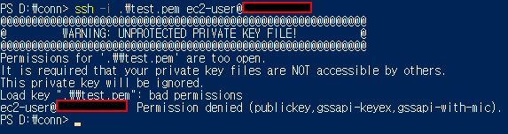
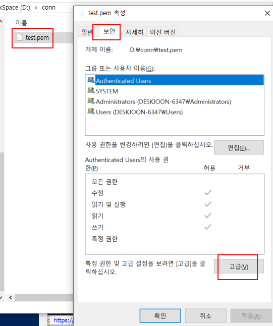
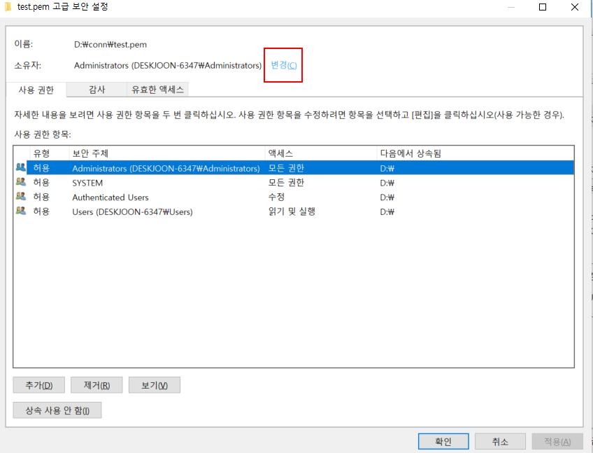
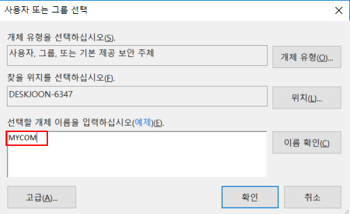
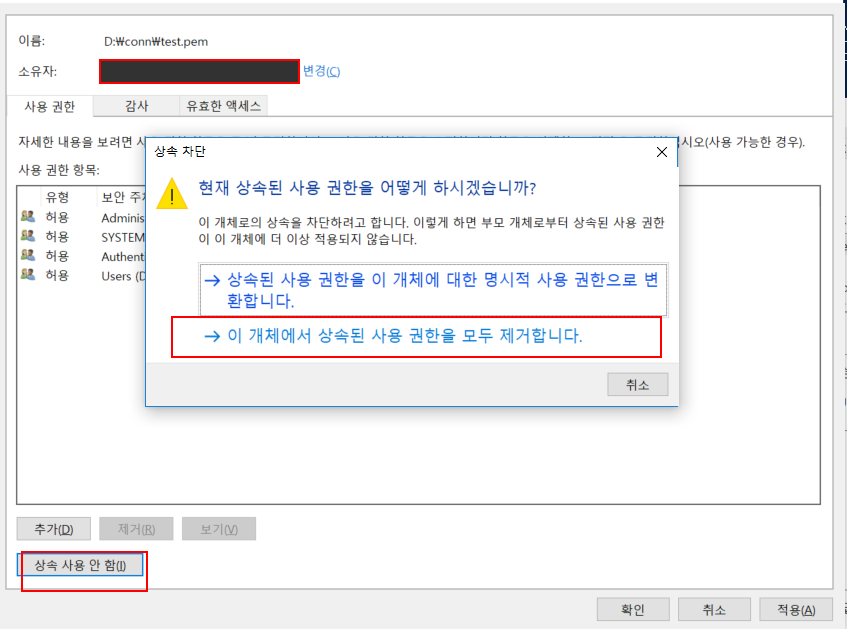
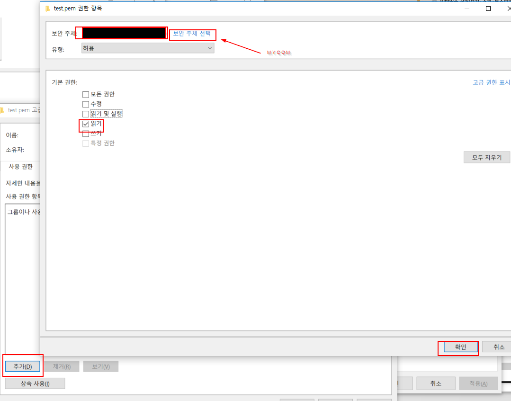
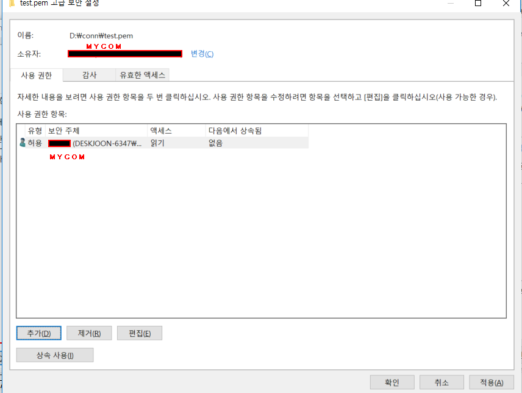
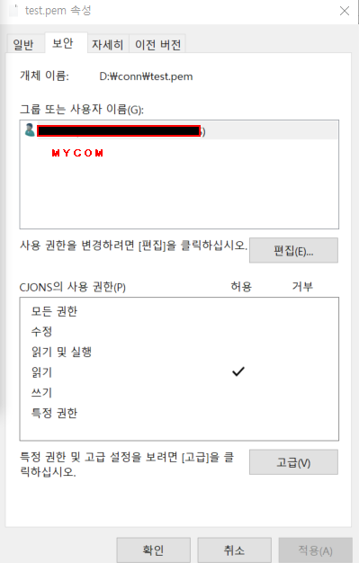
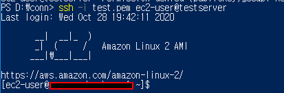

# How to change a permission of pem file to connect ssh in Windows 10

I faced with a problem. 

1. You open properties of the pem file and move security Tab, then Click the "고급" button

2. You have to change ownership of the file.

3. You select a username in your computer to decide the file's ownership. (must a user of person, EX MYCOM)

4. You select remove all Inheritance.

5. You add new permission to use. and Select security principal. (ex. MYCOM) , **Only Check the Read**

6. The result screen should be as follows.

7. Finally, Try reconnecting it. Then you'll be able to success.

